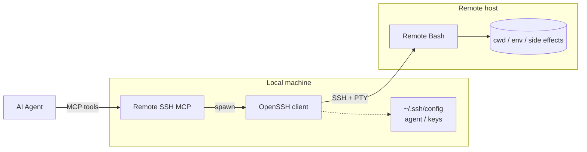
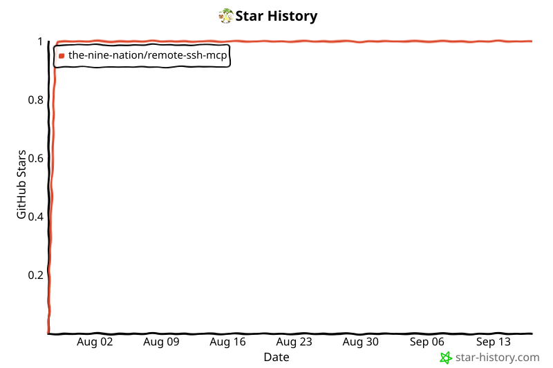

<p align="center">
  
</p>

<h1 align="center">Remote SSH MCP</h1>

<p align="center">
  <strong>Persistent, stateful remote Bash sessions for AI agents</strong><br />
  via the <a href="https://modelcontextprotocol.io">Model Context Protocol</a>
</p>

<p align="center">
  <a href="#why-remote-ssh-mcp">Why</a> ·
  <a href="#features">Features</a> ·
  <a href="#how-it-works">How it works</a> ·
  <a href="#mcp-tools">Tools</a> ·
  <a href="#quick-start">Quick start</a> ·
  <a href="#configuration">Config</a> ·
  <a href="#security">Security</a> ·
  <a href="./README.zh-CN.md">简体中文</a>
</p>

<p align="center">
  <a href="https://github.com/the-nine-nation/remote-ssh-mcp/blob/main/LICENSE"></a>
  <a href="https://nodejs.org/"></a>
  <a href="https://www.typescriptlang.org/"></a>
  <a href="https://modelcontextprotocol.io"></a>
  <a href="https://www.openssh.com/"></a>
  
  <a href="https://github.com/the-nine-nation/remote-ssh-mcp/releases/tag/v0.2.2"></a>
  <a href="https://www.npmjs.com/package/@zyluo/remote-ssh-mcp"></a>
  <a href="https://github.com/the-nine-nation/remote-ssh-mcp/stargazers"></a>
</p>

<p align="center">
  
</p>

---

## Why Remote SSH MCP?

Most agents reach remote machines like this:

```text
bash → ssh host "cmd" → disconnect → repeat
```

Every call pays the same tax:

| Pain | What happens |
|------|----------------|
| 🔁 **Token waste** | Banners, MOTD, login noise, and `pwd` / `whoami` probes flood the context |
| 🧊 **Lost state** | `cwd`, `export`, venv activation, and shell side effects vanish |
| 🔌 **Unstable** | Fresh connects hit timeouts, host-key prompts, ProxyJump, and auth jitter |
| 🌀 **Error spiral** | The model compensates with longer probe commands → more tokens |

**Remote SSH MCP** turns a long-lived remote Bash into first-class MCP tools. One session ID keeps working directory, environment variables, and shell side effects. Open a new session when you need a clean environment.

### Why pick this over one-shot `ssh` in bash?

Concrete gains for agent workflows (multi-step remote work: deploy, debug, build, inspect logs):

| Dimension | One-shot `ssh host "…"` | **Remote SSH MCP** |
|-----------|-------------------------|---------------------|
| 💰 **Tokens** | Each step re-pays connect noise + state probes; models often re-`cd` / re-`pwd` | **Pay once** on `ssh_open`; later `ssh_run` returns mostly **command output**. Structured tools + head/tail caps cut tool-result bloat. In multi-step sessions this commonly **cuts remote-tool context by ~50–80%** vs reconnect-every-time (exact savings depend on MOTD size and how chatty the model is). |
| ✅ **Success rate** | *N* steps ≈ *N* handshakes → *N* chances to fail (timeout, jump, agent, host key) | **One** handshake per session; subsequent commands ride a live shell. Long jobs use `running` + `ssh_peek` instead of killing the tool call and restarting. Fewer reconnects → **far fewer false “SSH failed” loops** mid-task. |
| 🧳 **Portability** | Remote needs nothing extra — but **every agent machine** reimplements the same brittle `ssh …` patterns | **Install once** on the machine that runs Claude / Cursor / Grok / etc. **Remote hosts install nothing** (no Node, no MCP daemon, no agent). Only a normal shell account + tools already required for SSH (`bash`, `base64`, `stty`, …). Keys and jump hosts stay in **local** `~/.ssh/config`. |
| 🧠 **Model ergonomics** | Model invents `ssh` strings, escapes, and recovery | Stable tools: `open → run → peek → close`. Session id is the only handle. |
| 🔐 **Trust boundary** | Easy to over-expose keys or prompt for passwords in-band | OpenSSH client only; tools never accept passwords or private-key material |

**Portability in one line:** put the MCP on your **dev box / AI host**; every server already in your SSH config is reachable — **zero package install on the remote fleet**.

```text
┌─────────────────────────┐         SSH (OpenSSH)         ┌──────────────────┐
│  Your laptop / CI agent │  ───────────────────────────► │  prod / staging  │
│  Claude · Cursor · Grok │     ~/.ssh/config · agent     │  no MCP install  │
│  + remote-ssh-mcp       │                               │  plain Bash OK   │
└─────────────────────────┘                               └──────────────────┘
```

**Token sketch (illustrative multi-step remote debug):**

```text
One-shot path (per step × 8):
  ssh wrapper + banner/MOTD + pwd/whoami + re-cd + command output
  → noise dominates; context fills with reconnect junk

Session path:
  ssh_open  → once (handshake + READY)
  ssh_run × 8 → mostly the real stdout/stderr (truncated head+tail)
  → context stays on the work product, not the transport
```

It does **not** reimplement SSH. Your system OpenSSH client stays in charge — so `~/.ssh/config`, known hosts, the SSH agent, ProxyJump routes, and hardware keys keep working exactly as they already do.

```text
ssh_hosts()              → discover allowed Host aliases
ssh_open(host)           → session id
ssh_run(id, command)     → same cwd + env as last time
ssh_peek / ssh_interrupt → observe or recover long / stuck work
ssh_close(id)            → release the shell and connection
```

---

## Features

### 🧠 Persistent remote sessions

- One **stable session ID** maps to one long-lived remote Bash
- **`cwd` and environment** survive across `ssh_run` calls
- Open a **fresh session** whenever you need a clean slate
- Multiple sessions can target the same or different hosts (up to `maxSessions`)

### 🔧 Native OpenSSH integration

- Spawns the real **`ssh` binary** — no custom crypto stack
- Honors **`~/.ssh/config`**, `Include`, agent sockets, and **ProxyJump**
- Forces **`BatchMode=yes`** and **`StrictHostKeyChecking=yes`**
- Never accepts passwords, private-key text, or arbitrary SSH option args from the model

### 📡 Long-running command friendly

- `ssh_run` waits up to `wait_sec` (default **10s**), then returns `status: "running"` while the remote command continues
- Poll with **`ssh_peek(wait_sec=...)`** long-poll instead of busy-looping
- Optional hard **`timeout_sec`** sends Ctrl-C; no automatic kill by default
- Ideal for `docker pull`, builds, downloads, and deploys that must not block the tool call forever

### 🛡️ Safety & control plane

- **Exact Host-alias allowlist** from `ssh_config` + optional config / env overrides
- Patterns with `*`, `?`, or `!` are ignored
- **Fail-closed interrupt**: if shell recovery cannot be confirmed after Ctrl-C, the session is closed
- Built-in **denylist** for a few obviously destructive patterns (not a full policy engine)
- **Idle reaping**, session caps, and a **JSONL audit log** (`0600`) with hashed commands

### 📦 Clean tool results for models

- Separate **`stdout` / `stderr`** streams
- Head-and-tail **byte truncation** with valid UTF-8 boundaries
- **ANSI / PTY noise stripped** before the model sees output (colors, CSI, bracketed-paste markers, control-only blank lines)
- **Quiet open-frame**: `TERM=dumb`, `NO_COLOR`, bracketed-paste off — less junk at the source
- **Slim JSON payloads**: omit empty `stderr`, `false` truncation flags, and request-echo fields so dual `content` + `structuredContent` stays cheap
- `ssh_hosts` returns only safe metadata: `alias`, `hostname`, `user`, `port`, `proxy_jump`
- Never leaks `IdentityFile`, certificates, agent sockets, or `ProxyCommand`

### 🔌 MCP-native

- **stdio** transport for Claude Desktop, Cursor, and other MCP hosts
- Compatible with both legacy and current MCP handshakes
- Parent / stdio exit closes every tracked SSH connection

---

## How it works



**Typical agent flow**

```text
1. ssh_hosts()                 # pick an alias from the allowlist
2. ssh_open(host="prod")       # get session id "s_…"
3. ssh_run(id, "cd app && …")  # state sticks to this id
4. ssh_run(id, "npm test")     # still in app/, env preserved
5. ssh_peek(id, wait_sec=20)   # long-poll a slow job
6. ssh_close(id)               # clean up when done
```

---

## MCP tools

| Tool | What it does |
|------|----------------|
| 🗂️ **`ssh_hosts`** | List allowed Host aliases (safe metadata only). Pass `reload=true` after editing `~/.ssh/config` |
| 🔓 **`ssh_open`** | Open a clean persistent shell for an allowed Host alias → returns session `id` |
| ▶️ **`ssh_run`** | Run a non-interactive command in an existing session |
| 👀 **`ssh_peek`** | Latest N lines of output + status; optional `wait_sec` long-polls while running |
| ⛔ **`ssh_interrupt`** | Send Ctrl-C and wait for confirmed shell recovery |
| 📋 **`ssh_list`** | List sessions, cwd, state, idle countdown, and capacity |
| 🔒 **`ssh_close`** | Tear down remote temp state and close the connection |

### Tool parameters (essentials)

| Tool | Key params |
|------|------------|
| `ssh_open` | `host` (required Host alias), optional `name` label |
| `ssh_run` | `id`, `command`, optional `wait_sec`, optional `timeout_sec` |
| `ssh_peek` | `id`, optional `lines` (default 50, max 1000), optional `wait_sec` |
| `ssh_interrupt` / `ssh_close` | `id` |
| `ssh_hosts` | optional `reload` boolean |

---

## Quick start

### Requirements

| Requirement | Notes |
|-------------|--------|
| **Node.js** | 20 or newer |
| **OpenSSH client** | System `ssh` on PATH (or set `sshPath`) |
| **Remote host** | Bash + `base64`, `stty`, `mkdir`, `cat`, `rm` |
| **SSH setup** | Host alias in `~/.ssh/config`, host key already trusted |

> ⚠️ First-time host-key confirmation and authentication must be completed in a normal terminal. The MCP server never shows password or trust prompts.

### Install

```bash
git clone https://github.com/the-nine-nation/remote-ssh-mcp.git
cd remote-ssh-mcp
npm install
npm run build
npm test
```

Run the server:

```bash
node /absolute/path/to/remote-ssh-mcp/dist/index.js
```

Or install from npm (once published):

```bash
npx @zyluo/remote-ssh-mcp
# or
npm install -g @zyluo/remote-ssh-mcp
remote-ssh-mcp
```

Or, after a local package install from this repo, use the `remote-ssh-mcp` executable.

### MCP host configuration

Most stdio hosts accept a shape like this (outer key may differ by product):

```json
{
  "mcpServers": {
    "remote-ssh": {
      "command": "node",
      "args": [
        "/absolute/path/to/remote-ssh-mcp/dist/index.js"
      ],
      "env": {
        "SSH_MCP_ALLOWED_HOSTS": "prod,staging"
      }
    }
  }
}
```

**Cursor** · **Claude Desktop** · **Claude Code** · other MCP-capable hosts: point `command` / `args` at the built `dist/index.js` and set `SSH_MCP_ALLOWED_HOSTS` (or rely on auto-discovery from `~/.ssh/config`).

`SSH_MCP_ALLOWED_HOSTS` **adds** aliases to the allowlist. By default the server also discovers exact `Host` entries from `~/.ssh/config` and its `Include` files. Tool inputs accept only safe aliases — not `user@host`, ports, or extra SSH options.

After editing `~/.ssh/config`, call `ssh_hosts(reload=true)` instead of restarting the server.

### Credential boundary

Authentication stays inside the local OpenSSH client:

- Tools never accept passwords or private-key material
- `ssh_hosts` never returns key paths, certs, agent sockets, or `ProxyCommand`
- Agents should call `ssh_open` with a Host alias and **must not** read `~/.ssh` private keys from disk

---

## Configuration

Optional config file (default path):

```text
~/.config/remote-ssh-mcp/config.json
```

```json
{
  "allowedHosts": ["prod", "staging"],
  "sshConfigPath": "~/.ssh/config",
  "sshPath": "ssh",
  "maxTimeoutSec": 1800,
  "defaultWaitSec": 10,
  "maxWaitSec": 30,
  "openTimeoutSec": 20,
  "idleTimeoutSec": 1800,
  "interruptGraceSec": 5,
  "maxSessions": 8,
  "outputMaxBytes": 32768,
  "outputHeadBytes": 4096,
  "auditLogPath": "~/.local/state/remote-ssh-mcp/audit.jsonl"
}
```

### Environment variables

| Variable | Purpose |
|----------|---------|
| `SSH_MCP_CONFIG` | Configuration file path |
| `SSH_MCP_ALLOWED_HOSTS` | Comma-separated additional Host aliases |
| `SSH_MCP_SSH_CONFIG` | SSH config path |
| `SSH_MCP_SSH_PATH` | OpenSSH executable |
| `SSH_MCP_MAX_TIMEOUT_SEC` | Max explicit command timeout |
| `SSH_MCP_DEFAULT_WAIT_SEC` | How long `ssh_run` waits before returning `running` |
| `SSH_MCP_MAX_WAIT_SEC` | Max `wait_sec` on `ssh_run` / `ssh_peek` |
| `SSH_MCP_OPEN_TIMEOUT_SEC` | Connect / handshake timeout |
| `SSH_MCP_IDLE_TIMEOUT_SEC` | Idle session lifetime |
| `SSH_MCP_INTERRUPT_GRACE_SEC` | Marker recovery grace after Ctrl-C |
| `SSH_MCP_MAX_SESSIONS` | Maximum live sessions |
| `SSH_MCP_OUTPUT_MAX_BYTES` | Per-stream retained output limit |
| `SSH_MCP_OUTPUT_HEAD_BYTES` | Retained head bytes when truncating |
| `SSH_MCP_AUDIT_LOG` | JSONL audit-log path |

Environment variables override the file. The audit log is created with mode `0600` and records session, host, result, duration, command length, command name, and SHA-256 — **not** full argument strings (reduces secret leakage).

---

## Execution semantics

Detailed rules the agent (and you) should know:

| Topic | Behavior |
|-------|----------|
| **Concurrency** | One session runs one foreground command at a time; extra `ssh_run` → `busy` |
| **`wait_sec`** | Limits only how long the **MCP call** waits. On expiry: `status: "running"`, remote work continues |
| **Do not retry** | Never re-issue the same long command after `running` — poll with `ssh_peek` |
| **Hard timeout** | Only an explicit `timeout_sec` creates a deadline that sends Ctrl-C |
| **`ssh_peek`** | Default last 50 lines (max 1000); byte caps still apply; optional long-poll `wait_sec` |
| **stdin** | User commands get `/dev/null` — no `vim`, `top`, or interactive installers |
| **Interrupt recovery** | Ctrl-C + grace period for protocol marker; if recovery fails → session closed (fail-closed) |
| **Output** | stdout / stderr keep head + tail independently; always valid UTF-8 boundaries |
| **Denylist** | Blocks a few high-risk patterns only — not a complete policy engine |
| **Trust model** | Local trusted developer tool — **not** a multi-tenant remote execution service |
| **Host exit** | MCP host / stdio death closes all SSH connections; `nohup` / `setsid` jobs may survive |

**Example:** start `docker pull` with `wait_sec: 10` and no `timeout_sec`. A `running` result means the original pull is still active — do **not** start another. Call `ssh_peek` with a positive `wait_sec` until `idle`, interrupt it, or open another session for parallel work.

---

## Development

```bash
npm run typecheck
npm test
npm run build
npm audit --omit=dev
```

The test suite covers MCP stdio discovery and calls, persistent cwd / environment state, stream separation, framing across arbitrary chunk boundaries, timeout fail-closed behavior, shell death, allowlist discovery, output truncation, and the safety denylist.

Design notes and wire protocol: [远程SSH-MCP设计.md](./远程SSH-MCP设计.md).

---

## Security

Please **do not** report security vulnerabilities through public GitHub issues. Until a private advisory workflow is configured, contact the maintainer via the email on their [GitHub profile](https://github.com/the-nine-nation).

Remote commands can have irreversible side effects even when the MCP transport is healthy. Use least-privilege accounts, keep the allowlist narrow, and review host permissions carefully.

---

## Project status

| Item | Status |
|------|--------|
| Version | **0.2.2** |
| License | [MIT](./LICENSE) |
| Language | TypeScript (Node ≥ 20) |
| Protocol | MCP over stdio |
| Transport to host | System OpenSSH |

---

## Changelog

### 0.2.2 — quieter remote output, fewer tokens

PTY-backed interactive bash often injects escape sequences that look like “binary” when JSON-escaped (`\u001b[?2004h`, color CSI, cursor codes). That noise burned context on every `ssh_peek` / `ssh_run`.

| Change | What it does |
|--------|----------------|
| **Present-time sanitize** | Strip ANSI/OSC/CSI, honor CR overwrite (progress bars), drop control-only blank lines, then apply the `lines` window |
| **Quiet session open** | Export `TERM=dumb` / `NO_COLOR` / `CLICOLOR=0`, disable bracketed paste, send `\033[?2004l` once at open |
| **Slim tool payloads** | Drop empty `stderr`, `false` flags (`truncated`, `interrupted`, …), and echoed `lines`; keep empty `stdout` so silence stays explicit |
| **Tests** | Coverage for sanitize, open-frame quieting, session present path, and slim JSON |

Upgrade: `npm i -g @zyluo/remote-ssh-mcp@0.2.2` (or bump the package in your MCP config), then **restart the MCP process** so the new server binary is loaded.

### 0.2.1

- Fix READY-marker parsing when the open frame is PTY-echoed

### 0.2.0

- Initial public release on npm / GitHub

---

## Star History

If this project saves you tokens and flaky reconnects, a ⭐ on GitHub helps others find it.

<!-- star-history:start -->
<picture>
  <source media="(prefers-color-scheme: dark)" srcset="assets/star-history/star-history-dark.svg">
  
</picture>
<!-- star-history:end -->

<p align="center">
  <sub>Built for agents that need a real remote shell — not another one-shot <code>ssh host "…"</code>.</sub>
</p>
