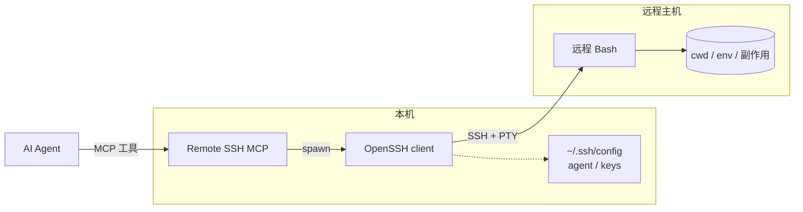

<p align="center">
  
</p>

<h1 align="center">Remote SSH MCP</h1>

<p align="center">
  <strong>为 AI Agent 提供持久、有状态的远程 Bash 会话</strong><br />
  基于 <a href="https://modelcontextprotocol.io">Model Context Protocol</a>
</p>

<p align="center">
  <a href="#为什么需要-remote-ssh-mcp">为什么</a> ·
  <a href="#功能特性">功能</a> ·
  <a href="#工作原理">原理</a> ·
  <a href="#mcp-工具">工具</a> ·
  <a href="#快速开始">快速开始</a> ·
  <a href="#配置">配置</a> ·
  <a href="#安全">安全</a> ·
  <a href="./README.md">English</a>
</p>

<p align="center">
  <a href="https://github.com/the-nine-nation/remote-ssh-mcp/blob/main/LICENSE"></a>
  <a href="https://nodejs.org/"></a>
  <a href="https://www.typescriptlang.org/"></a>
  <a href="https://modelcontextprotocol.io"></a>
  <a href="https://www.openssh.com/"></a>
  
  <a href="https://github.com/the-nine-nation/remote-ssh-mcp/releases/tag/v0.2.2"></a>
  <a href="https://www.npmjs.com/package/@zyluo/remote-ssh-mcp"></a>
  <a href="https://github.com/the-nine-nation/remote-ssh-mcp/stargazers"></a>
</p>

<p align="center">
  
</p>

---

## 为什么需要 Remote SSH MCP？

多数 Agent 访问远程机器的方式是：

```text
bash → ssh host "cmd" → 断开 → 再来一次
```

每次调用都在交同样的税：

| 痛点 | 表现 |
|------|------|
| 🔁 **Token 浪费** | banner、MOTD、登录噪声、`pwd` / `whoami` 探测反复灌进上下文 |
| 🧊 **状态丢失** | `cwd`、`export`、虚拟环境、shell 副作用无法延续 |
| 🔌 **不稳定** | 每次新建连接：超时、host key、ProxyJump、鉴权抖动 |
| 🌀 **错误放大** | 模型用更长探测命令补偿不确定性 → 更费 token |

**Remote SSH MCP** 把一条长生命周期的远程 Bash 做成一等 MCP 工具。相同 session id 会保留工作目录、环境变量和 shell 副作用；需要干净环境时关闭旧 session，再新开一个。

### 为什么选我们，而不是在 bash 里拼 `ssh`？

面向 Agent 多步远程任务（部署、排障、构建、看日志）的收益对照：

| 维度 | 一次性 `ssh host "…"` | **Remote SSH MCP** |
|------|----------------------|---------------------|
| 💰 **Token** | 每一步都重交连接噪声 + 状态探测；模型常反复 `cd` / `pwd` | **`ssh_open` 只付一次**；后续 `ssh_run` 主要返回**命令本身输出**。结构化工具 + 头尾截断压住结果体积。多步会话里，相对「每次重连」通常可 **少约 50–80% 的远程工具上下文噪声**（取决于 MOTD 大小与模型是否爱探测）。 |
| ✅ **成功率** | *N* 步 ≈ *N* 次握手 → *N* 次失败机会（超时、跳板、agent、host key） | 每个 session **只握手一次**；后续命令走已存活 shell。长任务用 `running` + `ssh_peek`，不必因工具调用超时就整段重来。重连变少 → **任务中途「SSH 又挂了」的假失败环显著减少**。 |
| 🧳 **便携性** | 远端本身也无需装东西——但**每台跑 Agent 的机器**都要重复同一套脆弱的 `ssh …` 拼装 | **只在跑 Claude / Cursor / Grok 等的本机装一次**。**远端机器零安装**（不要 Node、不要 MCP 守护进程、不要常驻 agent）。只要普通 shell 账号 + SSH 本就会用的工具（`bash`、`base64`、`stty` 等）。密钥与跳板仍在**本机** `~/.ssh/config`。 |
| 🧠 **模型心智** | 模型自己编 `ssh` 字符串、转义与恢复逻辑 | 稳定工具面：`open → run → peek → close`，session id 是唯一句柄 |
| 🔐 **信任边界** | 容易把密钥读进上下文，或在带内要密码 | 只走本机 OpenSSH；工具绝不接收密码 / 私钥内容 |

**便携性一句话：MCP 装在你的开发机 / AI 宿主上；`ssh_config` 里已有的机器都能管——服务器机群不用装任何包。**

```text
┌─────────────────────────┐         SSH（OpenSSH）        ┌──────────────────┐
│  笔记本 / CI Agent 机    │  ───────────────────────────► │  prod / staging  │
│  Claude · Cursor · Grok │     ~/.ssh/config · agent     │  无需安装 MCP    │
│  + remote-ssh-mcp       │                               │  普通 Bash 即可  │
└─────────────────────────┘                               └──────────────────┘
```

**Token 示意（多步远程排障，示意而非基准测试）：**

```text
一次性路径（每步 × 8）：
  ssh 包装 + banner/MOTD + pwd/whoami + 重新 cd + 命令输出
  → 噪声占主导，上下文被重连垃圾填满

会话路径：
  ssh_open  → 一次（握手 + READY）
  ssh_run × 8 → 主要是真实 stdout/stderr（头尾截断）
  → 上下文留给工作产物，而不是传输层
```

实现**不重写 SSH**，而是复用本机 OpenSSH client，因此 `~/.ssh/config`、known_hosts、SSH agent、ProxyJump 和硬件密钥策略仍然生效。

```text
ssh_hosts()              → 发现允许的 Host 别名
ssh_open(host)           → session id
ssh_run(id, command)     → 同一 cwd + 环境
ssh_peek / ssh_interrupt → 观察或恢复长任务 / 卡住的命令
ssh_close(id)            → 释放 shell 与连接
```

---

## 功能特性

### 🧠 持久远程会话

- 一个**稳定 session ID** 对应一条长生命周期远程 Bash
- **`cwd` 与环境变量** 在多次 `ssh_run` 之间保留
- 需要干净环境时**新开 session** 即可
- 可对同一或不同 host 开多个 session（受 `maxSessions` 限制）

### 🔧 原生 OpenSSH 集成

- 调用真实的 **`ssh` 可执行文件**，不自造加密栈
- 完整尊重 **`~/.ssh/config`**、`Include`、agent socket 与 **ProxyJump**
- 强制 **`BatchMode=yes`** 与 **`StrictHostKeyChecking=yes`**
- 绝不从模型侧接收密码、私钥文本或任意 SSH 参数

### 📡 友好支持长任务

- `ssh_run` 最多同步等待 `wait_sec`（默认 **10 秒**），到期返回 `status: "running"`，远端命令继续
- 用 **`ssh_peek(wait_sec=...)`** 做长轮询，而不是空转
- 可选硬超时 **`timeout_sec`** 才会发 Ctrl-C；默认不自动杀进程
- 适合 `docker pull`、构建、下载、部署等不应占死工具调用的任务

### 🛡️ 安全与控制面

- 来自 `ssh_config` + 配置 / 环境变量的**精确 Host 别名 allowlist**
- 含 `*`、`?`、`!` 的模式不会进入 allowlist
- **Fail-closed 中断**：Ctrl-C 后若无法确认 shell 恢复，则关闭 session
- 内置少量明显高风险命令的 **denylist**（不是完整策略引擎）
- **空闲回收**、session 上限，以及权限 `0600` 的 **JSONL 审计日志**（命令哈希）

### 📦 面向模型的干净输出

- **`stdout` / `stderr` 分离**
- 头尾 **字节截断**，并保证 UTF-8 边界完整
- **展示前剥离 ANSI / PTY 噪声**（颜色、CSI、bracketed-paste 标记、纯控制空行）
- **安静 open-frame**：`TERM=dumb`、`NO_COLOR`、关闭 bracketed-paste，从源头少产生垃圾输出
- **精简 JSON 载荷**：省略空 `stderr`、`false` 截断标志与请求回显字段，双通道 `content` + `structuredContent` 更省 token
- `ssh_hosts` 只返回安全元数据：`alias`、`hostname`、`user`、`port`、`proxy_jump`
- 永不泄露 `IdentityFile`、证书、agent socket 或 `ProxyCommand`

### 🔌 原生 MCP

- **stdio** 传输，适配 Claude Desktop、Cursor 等 MCP 宿主
- 兼容新旧 MCP 握手
- 宿主 / stdio 退出时回收全部已建立及正在建立的 SSH 连接

---

## 工作原理



**推荐 Agent 流程**

```text
1. ssh_hosts()                 # 从 allowlist 选别名
2. ssh_open(host="prod")       # 得到 session id "s_…"
3. ssh_run(id, "cd app && …")  # 状态绑定在此 id
4. ssh_run(id, "npm test")     # 仍在 app/，环境保留
5. ssh_peek(id, wait_sec=20)   # 长轮询慢任务
6. ssh_close(id)               # 用完清理
```

---

## MCP 工具

| 工具 | 作用 |
|------|------|
| 🗂️ **`ssh_hosts`** | 列出允许的 Host 别名（仅安全元数据）。改完 `~/.ssh/config` 后传 `reload=true` |
| 🔓 **`ssh_open`** | 为允许的 Host 别名新建持久 shell → 返回 session `id` |
| ▶️ **`ssh_run`** | 在已有 session 中执行非交互命令 |
| 👀 **`ssh_peek`** | 查看状态与最新 N 行输出；可选 `wait_sec` 在运行中长轮询 |
| ⛔ **`ssh_interrupt`** | 发送 Ctrl-C，并等待确认 shell 已恢复 |
| 📋 **`ssh_list`** | 列出 session、cwd、状态、idle 回收倒计时与容量 |
| 🔒 **`ssh_close`** | 清理远程临时状态并关闭连接 |

### 主要参数

| 工具 | 关键参数 |
|------|----------|
| `ssh_open` | `host`（必填 Host 别名），可选 `name` 标签 |
| `ssh_run` | `id`、`command`，可选 `wait_sec`、可选 `timeout_sec` |
| `ssh_peek` | `id`，可选 `lines`（默认 50，最大 1000），可选 `wait_sec` |
| `ssh_interrupt` / `ssh_close` | `id` |
| `ssh_hosts` | 可选布尔 `reload` |

---

## 快速开始

### 环境要求

| 要求 | 说明 |
|------|------|
| **Node.js** | 20 或更新 |
| **OpenSSH client** | 系统 `ssh` 在 PATH 上（或配置 `sshPath`） |
| **远程主机** | Bash 以及 `base64`、`stty`、`mkdir`、`cat`、`rm` |
| **SSH 配置** | Host 别名已写入 `~/.ssh/config`，host key 已信任 |

> ⚠️ 首次连接的 host key 确认与鉴权请在普通终端完成。MCP 服务不会弹出密码或信任提示。

### 安装

```bash
git clone https://github.com/the-nine-nation/remote-ssh-mcp.git
cd remote-ssh-mcp
npm install
npm run build
npm test
```

启动：

```bash
node /absolute/path/to/remote-ssh-mcp/dist/index.js
```

或从 npm 安装（发布后）：

```bash
npx @zyluo/remote-ssh-mcp
# 或
npm install -g @zyluo/remote-ssh-mcp
remote-ssh-mcp
```

本地从本仓库安装为包之后，也可使用 `remote-ssh-mcp` 可执行文件。

### MCP 宿主配置

使用 stdio 的宿主通常类似下面（外层键名因产品而异）：

```json
{
  "mcpServers": {
    "remote-ssh": {
      "command": "node",
      "args": [
        "/absolute/path/to/remote-ssh-mcp/dist/index.js"
      ],
      "env": {
        "SSH_MCP_ALLOWED_HOSTS": "prod,staging"
      }
    }
  }
}
```

**Cursor** · **Claude Desktop** · **Claude Code** 等：把 `command` / `args` 指到构建好的 `dist/index.js`，并设置 `SSH_MCP_ALLOWED_HOSTS`（或依赖从 `~/.ssh/config` 自动发现）。

`SSH_MCP_ALLOWED_HOSTS` 是**附加** allowlist。默认还会读取 `~/.ssh/config` 及其 `Include` 中的精确 `Host` 别名。工具参数只接受安全别名，不接受 `user@host`、端口或额外 SSH 选项。

修改 `~/.ssh/config` 后调用 `ssh_hosts(reload=true)` 即可，无需重启 MCP。

### 凭证边界

认证只发生在本机 OpenSSH client 内部：

- 工具不接受密码 / 私钥参数
- `ssh_hosts` 不返回密钥路径、证书、agent socket 或 `ProxyCommand`
- Agent 用 Host 别名调用 `ssh_open` 即可，**不要**用本地文件工具去读 `~/.ssh` 私钥

---

## 配置

可选配置文件默认路径：

```text
~/.config/remote-ssh-mcp/config.json
```

```json
{
  "allowedHosts": ["prod", "staging"],
  "sshConfigPath": "~/.ssh/config",
  "sshPath": "ssh",
  "maxTimeoutSec": 1800,
  "defaultWaitSec": 10,
  "maxWaitSec": 30,
  "openTimeoutSec": 20,
  "idleTimeoutSec": 1800,
  "interruptGraceSec": 5,
  "maxSessions": 8,
  "outputMaxBytes": 32768,
  "outputHeadBytes": 4096,
  "auditLogPath": "~/.local/state/remote-ssh-mcp/audit.jsonl"
}
```

### 环境变量

| 环境变量 | 作用 |
|----------|------|
| `SSH_MCP_CONFIG` | 配置文件路径 |
| `SSH_MCP_ALLOWED_HOSTS` | 逗号分隔的附加 Host allowlist |
| `SSH_MCP_SSH_CONFIG` | SSH config 路径 |
| `SSH_MCP_SSH_PATH` | OpenSSH 可执行文件 |
| `SSH_MCP_MAX_TIMEOUT_SEC` | 显式 `timeout_sec` 的允许上限 |
| `SSH_MCP_DEFAULT_WAIT_SEC` | `ssh_run` 返回 `running` 前的默认等待 |
| `SSH_MCP_MAX_WAIT_SEC` | `ssh_run` / `ssh_peek` 的 `wait_sec` 上限 |
| `SSH_MCP_OPEN_TIMEOUT_SEC` | 建连 / 握手超时 |
| `SSH_MCP_IDLE_TIMEOUT_SEC` | idle 自动回收时间 |
| `SSH_MCP_INTERRUPT_GRACE_SEC` | Ctrl-C 后等待 marker 的宽限期 |
| `SSH_MCP_MAX_SESSIONS` | 最大并发 session 数 |
| `SSH_MCP_OUTPUT_MAX_BYTES` | stdout、stderr 各自保留上限 |
| `SSH_MCP_OUTPUT_HEAD_BYTES` | 截断时保留的头部字节数 |
| `SSH_MCP_AUDIT_LOG` | JSONL 审计日志路径 |

环境变量覆盖配置文件。审计日志权限固定为 `0600`，记录 session、host、状态、时长、命令长度、命令名和 SHA-256；**不**记录完整命令参数，降低凭证入日志的风险。

---

## 执行语义

| 主题 | 行为 |
|------|------|
| **并发** | 同一 id 同时只跑一个前台命令；再次 `ssh_run` 返回 `busy` |
| **`wait_sec`** | 只限制 **MCP 调用** 等待时长；到期返回 `running`，远端继续 |
| **不要重试** | 收到 `running` 后不要重发同一长命令 — 用 `ssh_peek` 轮询 |
| **硬超时** | 只有显式 `timeout_sec` 才会在到期后 Ctrl-C |
| **`ssh_peek`** | 默认最新 50 行（最大 1000）；字节上限仍生效；可长轮询 |
| **stdin** | 用户命令 stdin 为 `/dev/null` — 不要跑 `vim`、`top`、交互安装器 |
| **中断恢复** | Ctrl-C + 宽限期等协议 marker；恢复失败则关闭 session（fail-closed） |
| **输出** | stdout / stderr 独立保留头尾，始终在合法 UTF-8 边界截断 |
| **Denylist** | 只拦少量高风险模式，不是完整策略引擎 |
| **信任模型** | 面向本机可信开发者 — **不是**多租户远程执行服务 |
| **宿主退出** | MCP 宿主 / stdio 断开会回收 SSH；`nohup` / `setsid` 进程可能继续 |

**示例：** 用 `wait_sec: 10` 启动 `docker pull`，不设 `timeout_sec`。返回 `running` 表示原 pull 仍在进行 — **不要**再启一次。用带正 `wait_sec` 的 `ssh_peek` 等到 `idle`，或 `ssh_interrupt`，或另开 session 做并行工作。

---

## 开发

```bash
npm run typecheck
npm test
npm run build
npm audit --omit=dev
```

测试覆盖 MCP stdio 发现与调用、cwd / 环境持久化、流分离、任意分片边界上的帧解析、超时 fail-closed、shell 死亡、allowlist 发现、输出截断与 denylist。

协议与设计决策见 [远程SSH-MCP设计.md](./远程SSH-MCP设计.md)。

---

## 安全

请**不要**通过公开 GitHub Issue 报告安全漏洞。在配置私有安全公告流程之前，请通过维护者 [GitHub 主页](https://github.com/the-nine-nation) 上的邮箱联系。

即使 MCP 传输正常，远程命令也可能产生不可逆副作用。请使用最小权限账号、收紧 allowlist，并仔细审查目标主机权限。

---

## 项目状态

| 项 | 状态 |
|----|------|
| 版本 | **0.2.2** |
| 许可证 | [MIT](./LICENSE) |
| 语言 | TypeScript（Node ≥ 20） |
| 协议 | MCP over stdio |
| 到主机的传输 | 系统 OpenSSH |

---

## 更新日志

### 0.2.2 — 更安静的远端输出，更少 token

PTY + 交互式 bash 常注入转义序列；经 JSON 转义后像「二进制」（`\u001b[?2004h`、颜色 CSI、光标码等），每次 `ssh_peek` / `ssh_run` 都在浪费上下文。

| 改动 | 作用 |
|------|------|
| **展示时净化** | 剥离 ANSI/OSC/CSI，按 CR 覆盖（进度条），丢掉纯控制空行，再应用 `lines` 窗口 |
| **安静会话打开** | 导出 `TERM=dumb` / `NO_COLOR` / `CLICOLOR=0`，关闭 bracketed-paste，open 时发送一次 `\033[?2004l` |
| **精简工具载荷** | 省略空 `stderr`、`false` 标志（`truncated`、`interrupted` 等）与回显的 `lines`；保留空 `stdout` 以明确「无输出」 |
| **测试** | 覆盖 sanitize、open-frame 安静化、session 展示路径与 slim JSON |

升级：`npm i -g @zyluo/remote-ssh-mcp@0.2.2`（或在 MCP 配置中 bump 版本），然后**重启 MCP 进程**以加载新服务端。

### 0.2.1

- 修复 open frame 被 PTY 回显时 READY 标记解析失败

### 0.2.0

- 首次公开发布（npm / GitHub）

---

## Star History

如果这个项目帮你省了 token、少踩了断线坑，点个 ⭐ 能让更多人发现它。

<!-- star-history:start -->
<picture>
  <source media="(prefers-color-scheme: dark)" srcset="assets/star-history/star-history-dark.svg">
  
</picture>
<!-- star-history:end -->

<p align="center">
  <sub>给需要「真·远程 shell」的 Agent —— 而不是再拼一次 <code>ssh host "…"</code>。</sub>
</p>
